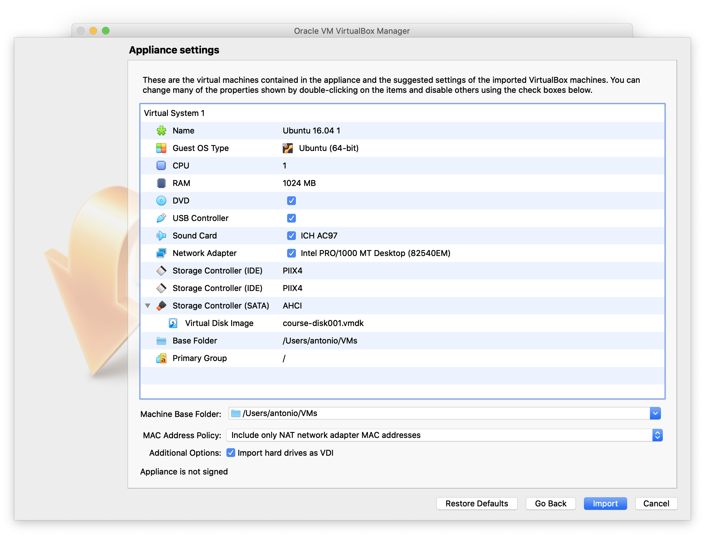
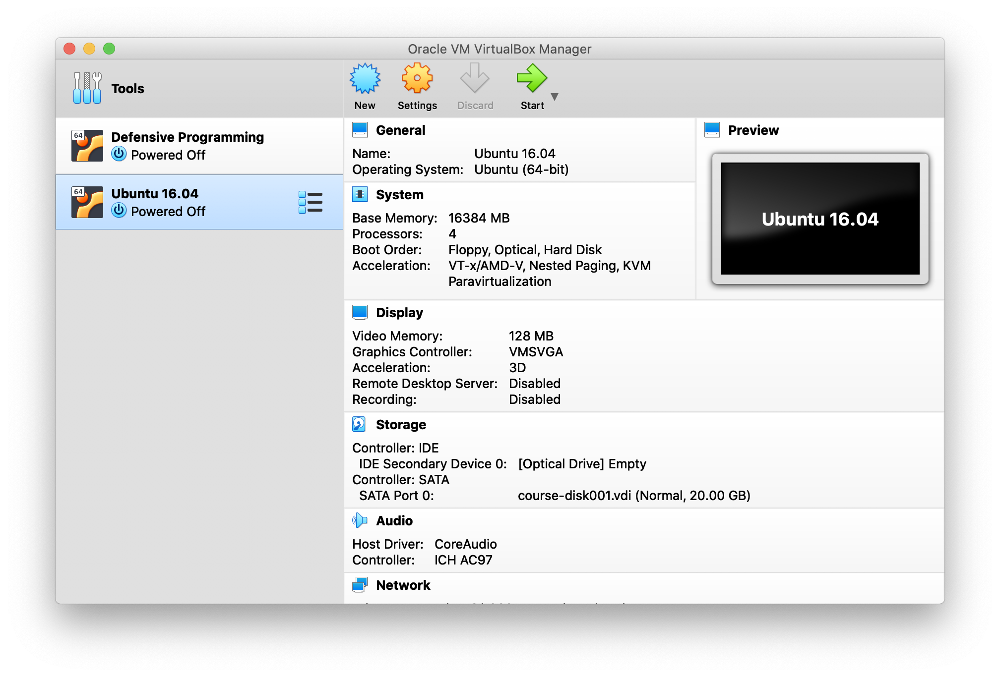
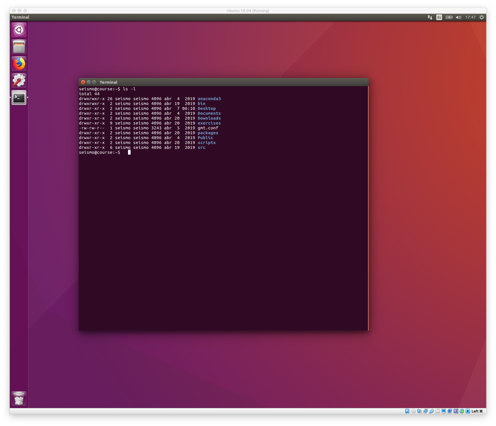

# Instalación de la máquina virtual

Para la realización de los ejercicios he preparado una máquina virtual en Linux
conteniendo todo el software ya instalado y los datos necesarios para llevarlos a cabo.

El archivo `course.ova` con la máquina virtual (6.4 GB) puede descargarse en este
[link](https://www.dropbox.com/s/wr3spoq4fld1swb/course.ova?dl=0).

Para instalar la máquina virtual necesitaréis el software `VirtualBox`. Este software
es gratuito y está disponible para ordenadores en Windows, macOS y Linux. Puede
descargarse en la página principal de [VirtualBox](https://www.virtualbox.org).

Una vez instalado `VirtualBox` habréis de crear la máquina virtual utilizando el
archivo `course.ova` y siguiendo los siguientes pasos:

1. Abrir la aplicación `VirtualBox`
2. Abrir el menú: `File > Import Appliance`
3. Navegar hasta el directorio donde habéis descargado el archivo `course.ova`,
   seleccionad el archivo y haced click en `Open` y después en `Continue`. Entonces
   aparecerá una ventana similar a esta: 
4. En esta ventana podéis cambiar algunos valores como el nombre de la máquina virtual,
   el número de CPUs, y la RAM. Por el momento se pueden dejar con sus valores por
   defecto y se pueden cambiar más adelante. Hacer click en `Import` para generar la
   máquina virtual. Esto puede tardar unos minutos dependiendo del ordenador.
5. Una vez creada la máquina virtual aparece la ventana para administrar máquinas virtuales:
   
   Si no habéis modificado el nombre, la nueva máquina virtual aparecerá como `Ubuntu 16.04`.
   Haciendo click en el botón `Settings` pueden modificarse los valores de CPUs, RAM, etc de
   la máquina virtual. En cuanto a CPUs, con 1 es suficiente. En cuanto a la RAM, un valor
   entre 1 GB y la mitad de la RAM del ordenador es apropiado. Si vuestro ordenador tiene poca
   RAM (4 GB o menos), intentad no correr ninguna otra aplicación mientras utilizáis la máquina
   virtual.
6. Una vez hayáis modificado los ajustes de la máquina virtual, podéis arrancarla haciendo click
   el `Start` (flecha verde).
   Si la máquina virtual ha arrancado correctamente, podéis hacer click en el icono de la aplicación
   `Terminal` y ejecutar el comando `ls -l`. Entonces vuestra pantalla debería ser similar a esta:
   
7. Una vez inicada la máquina virtual, es conveniente instalar las `Guest Additions`. Ir al menú
   `Devices > Insert Guest Additions CD Image...`. Esto montará un CD virtual que ejecutará 
   automaticamente la instalación de las `Guest Additions`. Para la instalación pedirá el
   password de administrador de la máquina virtual, que es **seismo**. Una vez se hayan instalado, expulsar
   el CD y reiniciar la máquina virtual. La instalación solo ha de realizarse una vez.
8. Si la máquina virtual no ha arrancado correctamente o reacciona muy lentamente, mirad la 
   sección **Posibles problemas** al final de esta página.

La máquina virtual que habéis instalado contiene un entorno de trabajo completo para
aplicaciones de Sismología en general y de Tomografía de Ondas Superficiales en particular.
Tiene instaladas las siguientes aplicaciones:

- `SAC` (Seismic Analysis Code): herramienta interactiva para el análisis de sismogramas
- `SEISAN`: paquete para el procesado de terremotos y redes sísmicas
- `CPS` (Computer Programs in Seismology): colección de programas desarrollados por
   Bob Herrmann (University of Saint Louis) para múltiples aplicaciones en Sismología
   (procesado de ondas superficiales, generación de sismogramas sintéticos, determinación
   de mecanismos focales, etc).
- `GMT5` (Generic Mapping Tools): programas para generar mapas, y gráficos para visualización
   de datos.
- Programas llevar a cabo el proceso completo de tomografía con ondas superficiales.

Cuando hayáis confirmado que la máquina virtual funciona correctamente, entonces podréis
borrar el archivo `course.ova` para ahorrar espacion en disco.

## Posibles problemas:

A pesar de que `VirtualBox` es posiblemente el programa más extendido para crear máquinas
virtuales con distintos sistemas operativos, es posible que os encontréis con algunos
problemas al correr la máquina virtual. Los problemas más comunes son:

### Utilizando Windows: VirtualBox no puede crear la máquina virtual

Al abrir el archivo `course.ova` con `File > Import Appliance` da un error y no crea la
máquina virtual.

Esto puede deberse a que el archivo `.ova` no se haya descargado correctamente y esté corrompido.
Los archivos `.ova` son en realidad archivos `.tar`, así que pueden descomprimirse utilizando
cualquier programa que pueda leer archivos `.tar`. Para ello cambiar el nombre del archivo
`course.ova` a `course.tar`. Hacer doble-click sobre `course.tar` y comprobar si se descomprime
correctamente. Si esto da algún error significa que probablemente el archivo está corrompido,
así que habría que descargarlo de nuevo.

Si funciona la descompresión, se debería haber creado dos archivos: `course.ovf` y `course-disk001.vmdk`.
El archivo con la extensión `.vmdk` contiene el disco virtual. Es posible entonces crear la máquina
virtual a partir de este archivo por ejemplo siguiendo las instrucciones es este
[link](https://medium.com/riow/how-to-open-a-vmdk-file-in-virtualbox-e1f711deacc4). En nuestro caso
hay que seleccionar Ubuntu 64-bit como el tipo de máquina virtual (no Windows como en el ejemplo).

### Utilizando Windows: VirtualBox crea la máquina virtual pero al arrancar da un error

Al intentar arrancar la máquina virtual es posible que aparezca un mensaje de error
similar a este:

    VT-x/AMD-V hardware acceleration is not available on your system

Si vuestra CPU es muy antigua puede que no soporte `VT-x/AMD-V` y entonces no podréis utilizar
la máquina virtual. Sin embargo lo más habitual es que `VT-x/AMD-V` no esté activado, y/o que
vuestro ordenador esté utilizando `Hyper-V` que es la tecnología de virtualización de Microsoft
y que suele estar activada por defecto.

Si os encontráis con este error, en este
[link](https://appuals.com/fix-vt-x-amd-v-hardware-acceleration-is-not-available-on-your-system/)
podéis encontrar información detallada sobre como activar `VT-x/AMD-V`.

Si al arrancar la máqina virtual no os da ningún error pero funciona muy lenta, puede
deberse al problema descrito en este 
[link](https://mybyways.com/blog/virtualbox-very-slow-on-windows-10)
y que también tiene que ver con `Hyper-V`.

### Utilizando macOS

Si tenéis in Mac reciente con pantalla retina, también es posible que VirtualBox funcione 
muy lentamente, incluso en ordenadores con varios núcleos y mucha memoria.

La solución es abrir VirtualBox en modo de baja resolución, siguiendo los siguientes pasos descritos en este
[post de Reddit](https://www.reddit.com/r/virtualbox/comments/houi9k/how_to_fix_virtualbox_61_running_slow_on_mac/):

1. Navigate to Apps folder. Choose VirtualBox.app
2. Right click on VirtualBox.app, Show Package Contents.
3. Contents -> Resources -> VirtualBoxVM.app (right click -> Get info)
4. Check the "Open in Low Resolution" checkbox.
5. Run the Virtual Machine in 100% scale mode and with the "VBoxSVGA" graphics controller selected

