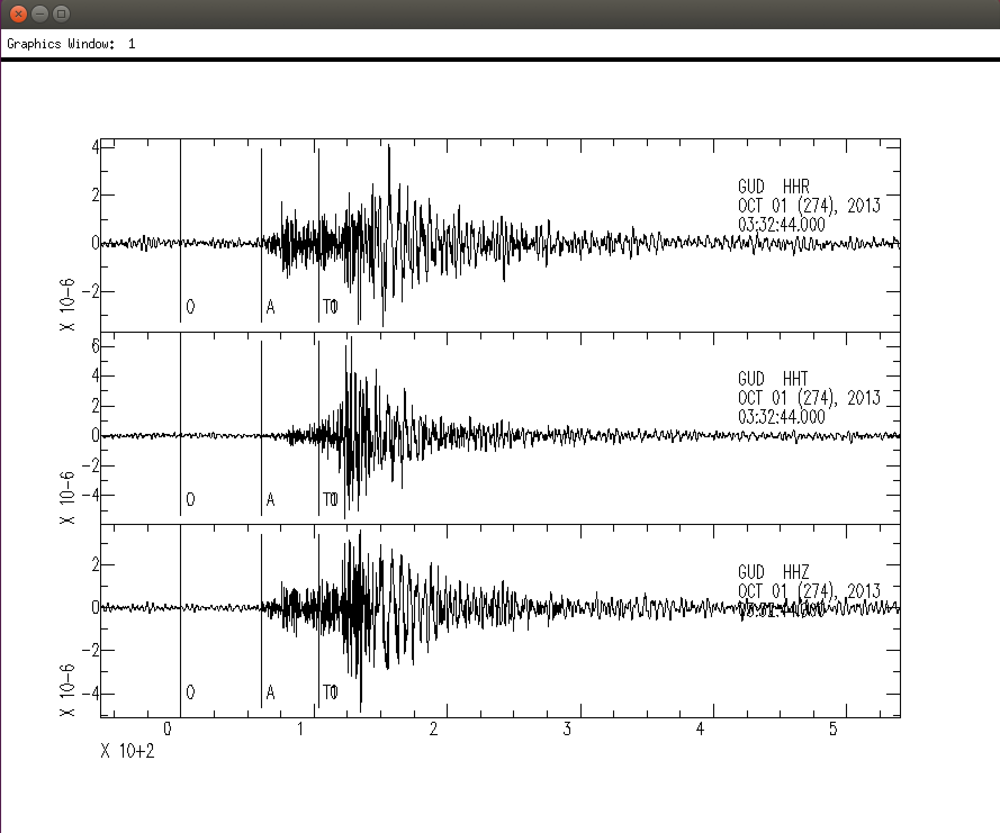
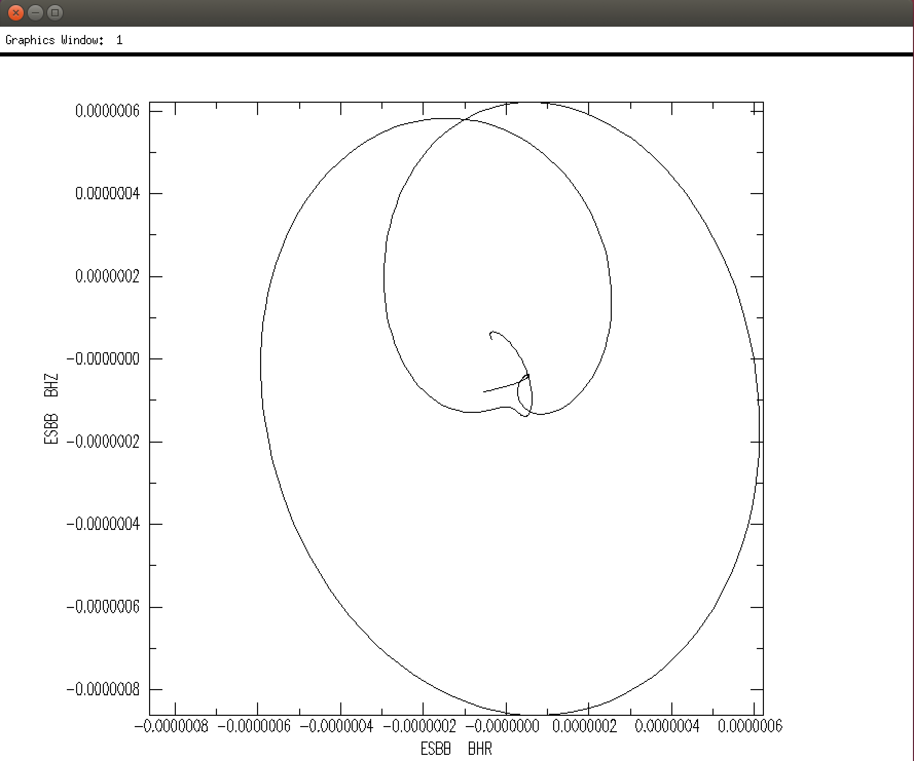
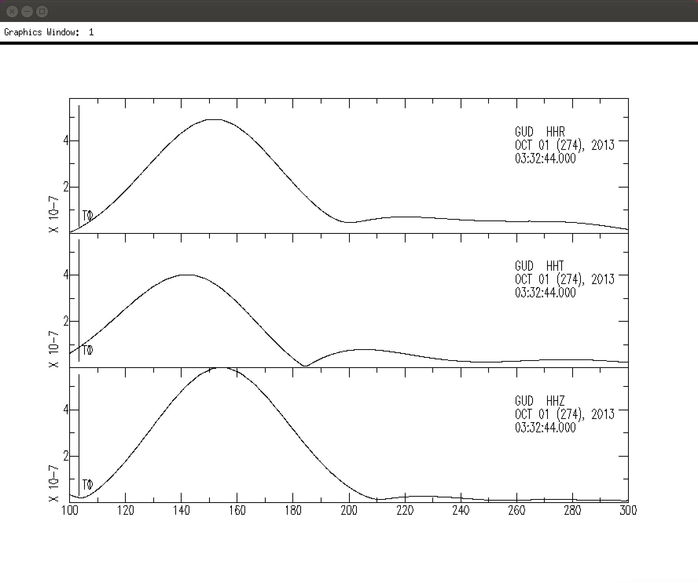
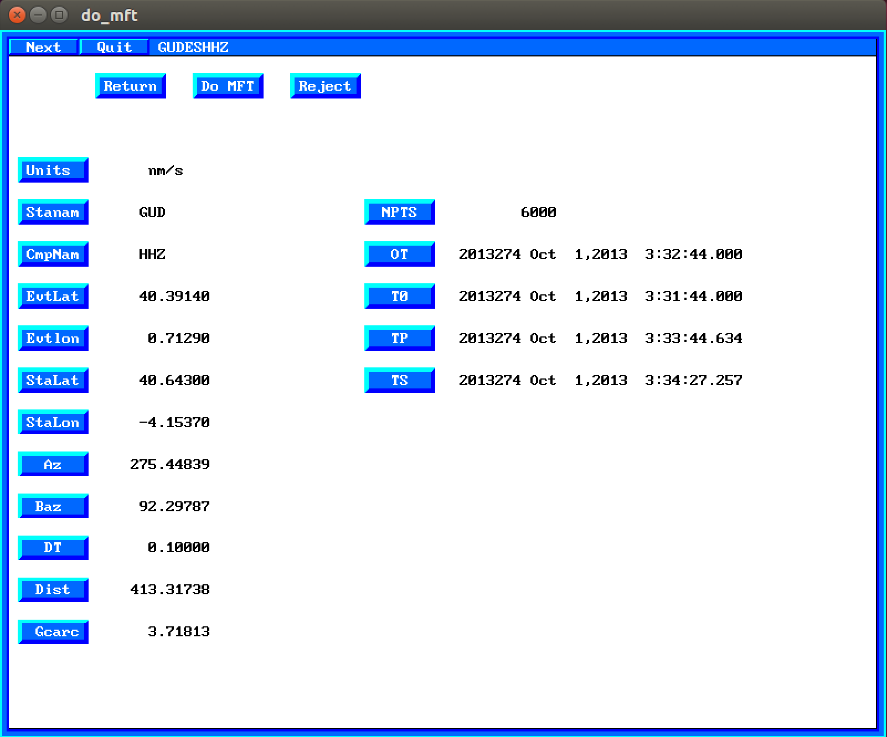
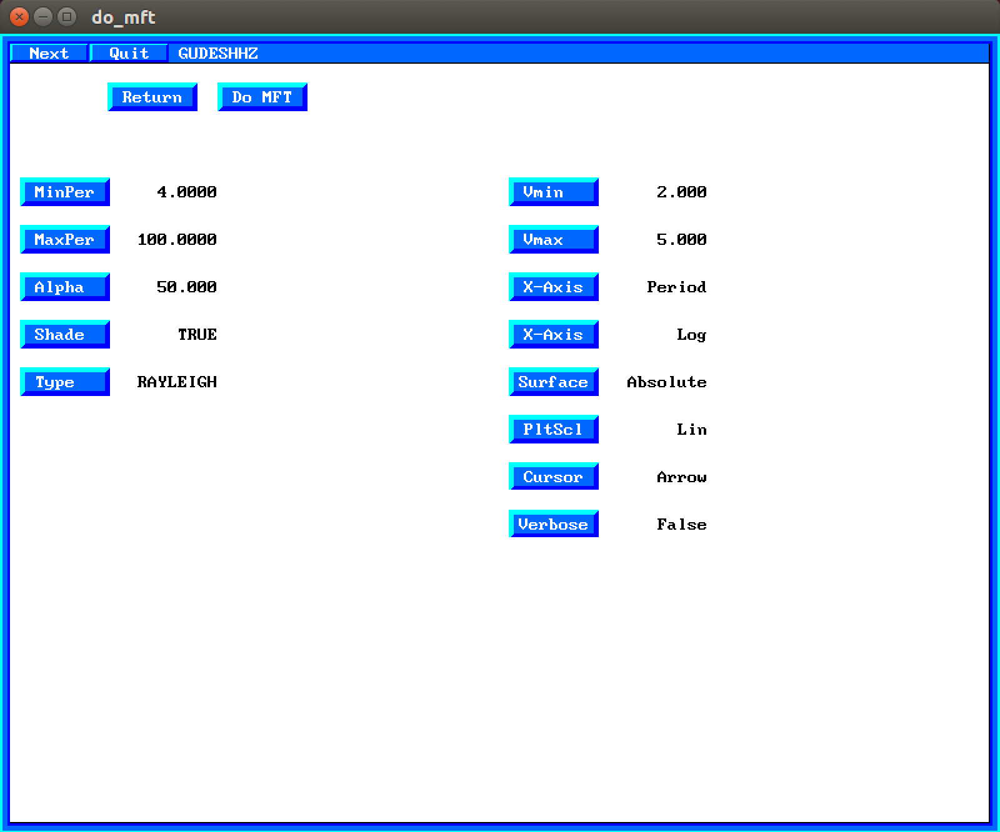
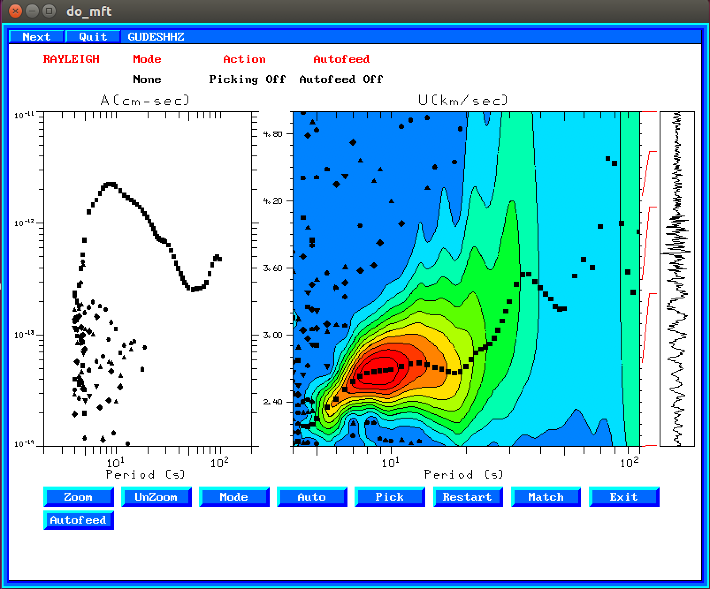
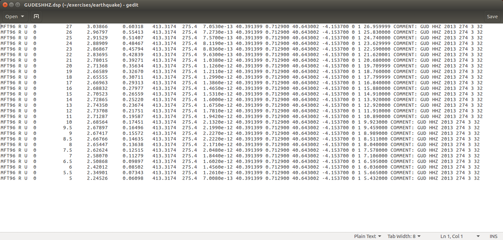

# 1. Medidas de dispersión de ondas superficiales de terremotos

## 1.1. Observación de ondas superficiales y fundamentos de SAC

En primer lugar utilizaremos el programa `SAC` (Seismic Analysis Code) para visualizar
sismogramas e identificar las ondas superficiales. El manual detallado de `SAC` se
encuentra en este [enlace](https://ds.iris.edu/files/sac-manual/).

Los sismogramas de este ejercicio se encuentran en el directorio `~/exercises/earthquake`
(el símbolo `~` significa **home directory**, en nuestro caso `/home/seismo`)

    $ cd                                # ir al home directory
    $ cd exercises/earthquake			# presionar TAB para completar el nombre

Lanzar el program `SAC` y ejecutar los siguientes comandos:

    $ sac
    SAC > r GUD*                    # lee los archivos para la estación GUD
    SAC > lh columns 2 delta baz    # listar los valores de la distacia epicentral y backazimuth 
    SAC > qdp off                   # no utilizar baja resolución en los plots
    SAC > p1                        # dibujar los datos
    SAC > rmean                     # quitar la media
    SAC > taper                     # aplicar un taper antes de filtrar
    SAC > lowpass co .1 n 3 p 2     # filtro pasa bajas frecuencias
    SAC > ppk bell off              # plot and pick: usar “x” y “o” para hacer y deshacer zoom
    SAC > ...                       # practicar con ppk y presionar "q" para volver al programa
    SAC> r ESBBESBHZ ESBBESBHR      # leer solo las componentes vertical y radial
    SAC> rmean
    SAC> taper
    SAC> lpowpass                   # en SAC los comandos recuerdan los parámetros anteriores
    SAC> ppk                        # usar el cursor para comprobar que las componentes Z y T están desfasadas
    SAC> xlim 130 170               # limitar el rango de tiempo a dibujar
    SAC> p1
    SAC> ppm                        # dibujar el movimiento de la partícula
    SAC > q                         # salir de SAC
    $

Sismogramas originales para la estación GUD:

Sismogramas filtrados con pasa bajo de 10 segundos (después de ejecutar el comando `lowpass co .1 n 3 p 2`):

Movimiento de la partícula para la estación ESBB (después de ejecutar el comando `ppm`):

Repetir este procesado con otras estaciones.

Otros comandos útiles de `SAC` son: `bp`, `fft`, `psp`. Buscarlos en el manual o usar
la ayuda del programa:

    SAC > help bp
 
Probar estos comandos con algunos de los sismogramas en este directoria

## 1.2. Medida de velocidad de grupo de terremotos

Ir al direcorio de trabajo:

    $ cd 
    $ cd exercises/earthquake

En primer lugar probaremos un método sencillo, que es el de filtrar el sismograma
en la banda de frecuencias (periodos) de interés, y calcular el máximo de la
envolvente del sismograma filtrado:

    $ sac
    SAC> r GUD*
    GUDESHHR GUDESHHT GUDESHHZ
    SAC> qdp off
    SAC> p1
    SAC> xlim 100 300
    SAC> p1
    SAC> rmean
    SAC> taper
    SAC> bp co .09 .11 n 3 p 2        # filtrar en una banda de frecuencia en torno a 0.1 Hz (10 segundos)
    SAC> p1
    SAC> envelope
    SAC> p1
    SAC> ppk bell off                 # colocar el cursor en el máximo de la envolvente y leer el tiempo

Después de aplicar el filtro y calcular la envolvente debería obtenerse una figura como esta:

Utilizar el cursor para leer el tiempo del máximo de la envolvente. La medida en la componente
transversal dará la velocidad de grupo de la onda Love, y la medida en la vertical (o radial)
dará la velocidad de la onda Rayleigh. La velocidad de grupo \(U\) se calcula simplemente haciendo:
\(U = \Delta / t\) donde \(\Delta\) es la distancia epicentral (variable `delta` de la cabecera
del archivo `SAC` y \(t\) es el tiempo de llegada medido del máximo de la envolvente.

Repetir este proceso para otros periodos (p.e. 5 segundos). Si la banda de frecuencia del filtro
es muy estrecha pueden aparecer artefactos en la señal filtrada.

En segundo lugar probaremos en método FTAN (frequency-time analysis), en concreto la implementación
de este método en el programa `do_mft` de los Computer Programs in Seismology.

Estando en el directorio de trabajo `~/exercises/earthquake` introducir:

    $ do_mft -G GUD* 

Debería aparecer una pantalla como esta, en la que se puede seleccionar el sismograma que se va
a analizar:

Seleccionar uno de los sismogramas, p.e. GUD HHZ. A continuación aparecerá una pantalla con 
información del sismograma:

Inicialmente las unidades del sismograma aparecen como `Unknown`. Haciendo click sobre el botón
azul `Units` se pueden seleccionar las unidades, que en nuestro caso son nanometros por segundo (nm/s).
Una vez estén seleccionadas las unidades, hacer click en el botón `Do MFT`.

Entonces aparecerá la ventana en la que se pueden seleccionar los parámetros para el
frequency-time analysis (o también denominado multiple filter analysis):

Inicialmente el tipo de ondas (parámetro `Type`) aparece como `UNKNOWN`. Haciendo click sobre
el botón `Type` se puede cambiar el tipo de onda a LOVE o RAYLEIGH, según el sismograma que
se haya seleccionando. Una vez seleccionado el tipo de onda, hacer click en el botón `Do MFT`
y aparecerá el resultado del análisis FTAN:

En el panel izquierdo se muestra el máximo de la amplitud espectral para cada periodo, y en 
el panel derecho la distribución de la energía en función de la frecuencia (periodo) y del
tiempo (velocidad). En este caso es fácil indetificar la energía asociado al modo fundamental
de la onda Rayleigh entre 3 y 30 segundos. El máximo de la amplitud espectral para cada
periodo viene indicado con símbolos negros: cuadrados para el máximo absoluto y otros símbolos
para máximos relativos.

La selección de los puntos de la curva de velocidad de grupo ha de hacerse de forma manual.
En primer lugar hacer click en el botón `Auto` y seleccionar `Fund` (modo fundamental).
A continuación hacer click en el primer punto que se quiera seleccionar, arrastrar el
cursor pasando por encima de los siguientes puntos a seleccionar y hacer click otra vez.
Los puntos seleccionados pasarán a color blanco. Repetir tantas veces como sea necesario
hasta seleccionar todos los puntos deseados. Si se quiere seleccionar o borrar un punto 
indivudialmente, hacer click en el botón `Pick` y luego sobre el punto. Si estaba seleccionado
(color blanco) pasará a no estar seleccionado (color negro) y viceversa.

Una vez seleccionados los puntos de la curva de dispersión hacer clic en `Exit` y 
pulsar si queréis guardar o no la curva de dispersión. Si decidís salvarla, creará
un archivo con el mismo nombre que el archivo del sismograma más la extensión `.dsp`.
Así, para el sismograma en `GUDESHHZ` creará el archivo `GUDESHHZ.dsp`.

Podéis ver el contenido de este archivo en pantalla haciendo:

    $ cat GUDESHHZ.dsp

o bien editarlo con un editor como `gedit`:

    $ gedit GUDESHHZ.dsp

Las columnas importantes de este archivo son:

1. MFT96: nombre del programa que ha generado el archivo
2. Tipo de onda (R o L)
3. Tipo de medida: U = velocidad de grupo, C = velocidad de fase
4. Modo: 0 = modo fundamental
5. Periodo de la medida (en segundos)
6. Velocidad de la medida (en km/s)

En este caso al velocidad de grupo medida para 10 segundos es de 2.69 km/s. Comparar este valor
con el obtenido utilizando el máximo de la envolvente.

Para procesar todos los archivos en un directorio:

    $ do_mft -G *T       # componente transversal para medir disperión de ondas Love
    $ do_mft -G *Z       # componente vertical para medir dispersión de ondas Rayleigh
    $ do_mft -G *R       # componente radial; debería dar la misma medida que utilizando la vertical

Comprobar también que las medidas de dispersión realizadas en las componentes vertical y radial son iguales.

[//]: # (TO-DO: script para comparar resultados)
