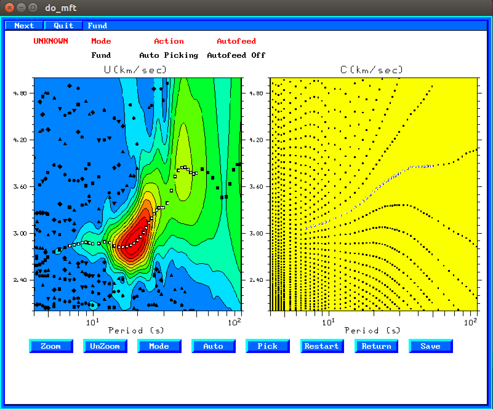

# 2. Procesado de correlaciones de ruido ambiente

En este ejercicio realizaremos medidas de velocidad de fase y de grupo
utilizando un método manual (`do_mft`) y un método automático.

## 2.1. Procesado manual con `do_mft`

La medida de curvas de dispersión para correlaciones de ruido ambiente con
`do_mft` es igual a la medida para registros de terremotos, excepto que,
al conocer la fuente de la correlación (fuerza impulsiva vertical) podemos
medir también la velocidad de fase (y no solo la de grupo como en el caso
de los terremotos).

Ir al directorio que contiene los archivos con las correlaciones de ruido ambiente:

    $ cd 
    $ cd exercises/correlations
    $ ls                                    # ver el contenido del directorio

Para seleccionar las velocidades de fase y de grupo de las correlaciones
de forma manual, ejecutar `do_mft` con las siguientes opciones:

    $ do_mft -G -IG *_S

Igual que con terremotos pero con una opción adicional: `PhVel`

Seleccionar la velocidad de grupo siguiendo los mismos pasos que en el ejercicio 1.
Cuando esté seleccionada hacer click en `PhVel`. Entonces aparecerá la pantalla siguiente:

En el panel de la derecha se muestra de nuevo el análisis FTAN, y en el de la
izquierda las posibles curvas de velocidad de fase. Hay que seleccionar la curva
que tenga unos valores de la velocidad similares (un poco superiores) a la curva
de velocidad de grupo. Esto se hace de la misma forma que con la velocidad de
grupo, pulsando primero `Auto` y después haciendo click sobre los puntos que se
quieren seleccionar. Los puntos seleccionados cambian a color blanco, como se 
muestra en la siguiente figura:

Para salvar la curva de velocidad de fase hacer click en `Save`. Esto generará 
un archivo con el mismo nombre que el archivo del sismograma, añadiéndole la
extensión `.phv`. Después de guardar el archivo de velocidad de fase el programa
vuelve a la pantalla de velocidad de grupo. En esta hay que pulsar `Exit` para
guardar el archivo con la velocidad de grupo (extensión `.dsp`).

Seleccionar por ejemplo el archivo `COR_ARAC.IG._MVO.PM._ZZ_S`, que es el
resultado de correlacionar las componentes verticales (Z) de las estaciones
ARAC (Aracena) y MVO (Marvao, Portugal). Realizar la medida de la velocidad de
fase y de grupo y guardar los resultados (archivos `COR_ARAC.IG._MVO.PM._ZZ_S.phv` y
`COR_ARAC.IG._MVO.PM._ZZ_S.dsp` respectivamente). Estas curvas pueden visualizarse
utilizando el script `plot_aftan_disp.sh`:

    $ plot_aftan_disp.sh COR_ARAC.IG._MVO.PM.   # COR_ARAC.IG._MVO.PM. es el prefijo de los archivos .dsp y .phv

El script producirá un warning de que faltan ciertos archivos (esto es normal puesto que no han sido creados todavía)
y generará un archivo en formato PostScript `COR_ARAC.IG._MVO.PM..ps` que puede visualizarse con el programa `gv`:

    $ gv COR_ARAC.IG._MVO.PM..ps                 # presionar "q" para salir de gv

La línea continua roja es la velocidad de fase y la línea discontinua roja la velocidad de grupo.

Verify that phase velocities are generally larger that group velocities. Also
verify that phase velocity curves usually do not have minima, while group
velocities often have.

## 2.2. Procesado automático utilizando `FTAN`

Crear un archivo de parámetros llamado `aftan.par`(p.e. utilizando `gedit`) que contenga esta línea:

    -1 1.0 5.0 2 100 20 1 0.5 0.2 2 COR_ARAC.IG._MVO.PM._ZZ_S

Explain meaning of parameters.

Verify that the reference phase velocity dispersion file `avg_phvel.dat` is present. Look at its contents.

El programa que lleva a cabo el análisis `FTAN` de forma automática se llama `aftani_c_pgl` y se ejecuta
de la siguiente forma:

    $ aftani_c_pgl aftan.par

Look at the output files. Plot them with:

    $ plot_aftan_disp.sh COR_ARAC.IG._MVO.PM.
    $ gv COR_ARAC.IG._MVO.PM..ps

Devise a method to process all the cross correlations in the current directory.

