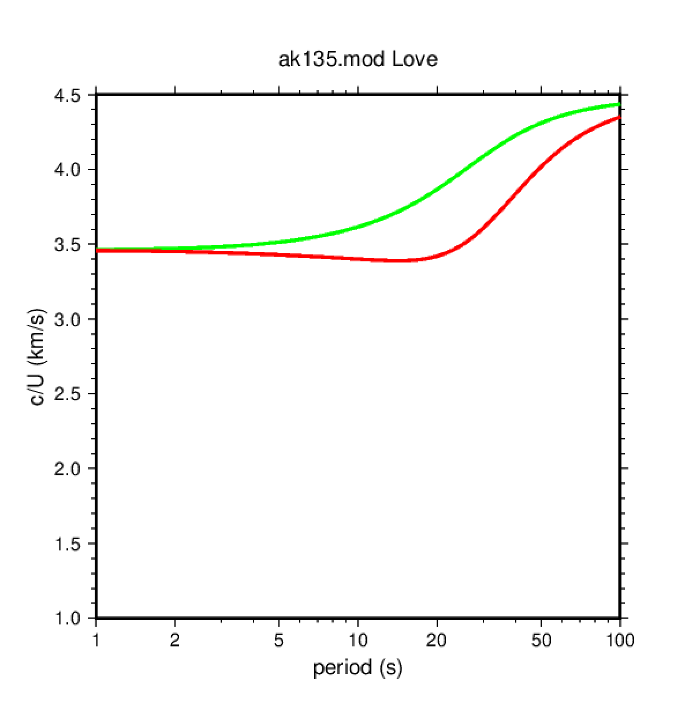
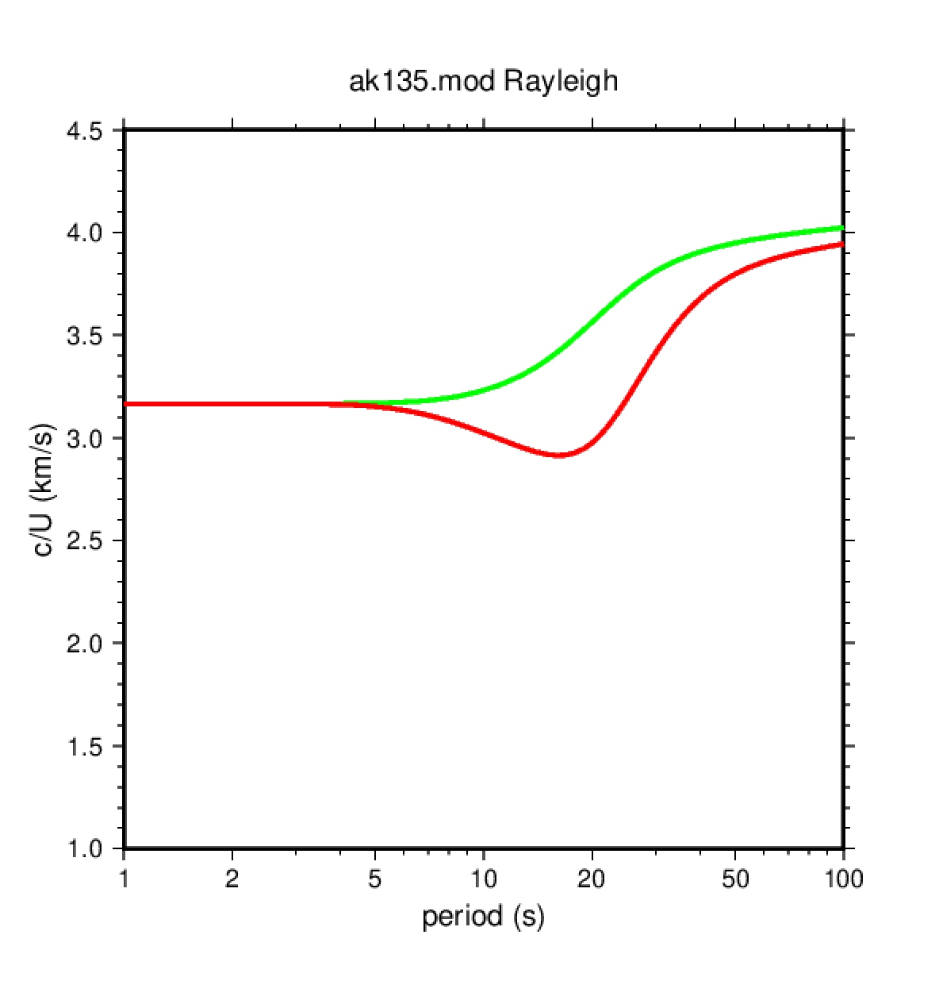
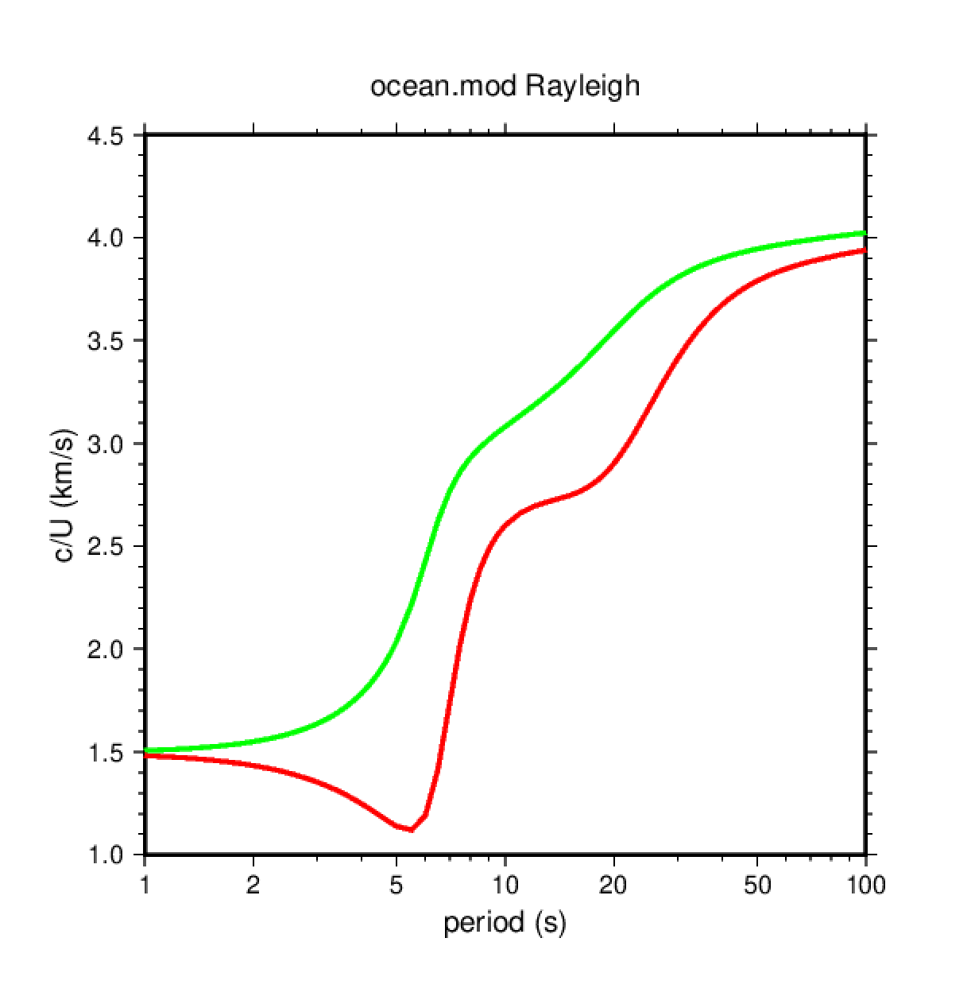

# 2. Calcular las curvas de dispersión para un modelo de velocidad

Ir al directorio de trabajo para este ejercicio:

    $ cd
    $ cd exercises/dispersion
    $ ls *.mod                     # muestra los archivos con extensión .mod

En el directorio se encuentra un archivo llamado `ak135.mod` que contiene la
descripción del modelo de tierra `ak135`:

```
MODEL.01
Model after     n iterations
ISOTROPIC
KGS
FLAT EARTH
1-D
CONSTANT VELOCITY
LINE08
LINE09
LINE10
LINE11
      H(KM)   VP(KM/S)   VS(KM/S) RHO(GM/CC)         QP         QS       ETAP       ETAS      FREFP      FREFS
     5.0000     5.8000     3.4600     2.7200   0.00       0.00       0.00       0.00       1.00       1.00
     5.0000     5.8000     3.4600     2.7200   0.00       0.00       0.00       0.00       1.00       1.00
     5.0000     5.8000     3.4600     2.7200   0.00       0.00       0.00       0.00       1.00       1.00
     5.0000     5.8000     3.4600     2.7200   0.00       0.00       0.00       0.00       1.00       1.00
     5.0000     6.5000     3.8500     2.9200   0.00       0.00       0.00       0.00       1.00       1.00
     5.0000     6.5000     3.8500     2.9200   0.00       0.00       0.00       0.00       1.00       1.00
     5.0000     6.5000     3.8500     2.9200   0.00       0.00       0.00       0.00       1.00       1.00
     5.0000     8.0400     4.4800     3.3198   0.00       0.00       0.00       0.00       1.00       1.00
     5.0000     8.0400     4.4800     3.3198   0.00       0.00       0.00       0.00       1.00       1.00
     5.0000     8.0400     4.4800     3.3198   0.00       0.00       0.00       0.00       1.00       1.00
     5.0000     8.0400     4.4800     3.3198   0.00       0.00       0.00       0.00       1.00       1.00
     5.0000     8.0400     4.4800     3.3198   0.00       0.00       0.00       0.00       1.00       1.00
     5.0000     8.0400     4.4800     3.3198   0.00       0.00       0.00       0.00       1.00       1.00
     5.0000     8.0400     4.4800     3.3198   0.00       0.00       0.00       0.00       1.00       1.00
     5.0000     8.0400     4.4800     3.3198   0.00       0.00       0.00       0.00       1.00       1.00
     5.0000     8.0400     4.4800     3.3198   0.00       0.00       0.00       0.00       1.00       1.00
     0.0000     8.0400     4.4800     3.3198   0.00       0.00       0.00       0.00       1.00       1.00
```

Las 11 primeras líneas del archivo son comentarios y la línea número 12 contiene la cabecera de los
valores que se listan a continuación. El significado de las columnas relevantes es:

1. espesor de la capa en km (atención, es el espesor, no la profundidad de la base de la capa!)
2. velocidad de la onda P (km/s)
3. velocidad de la onda S (km/s)
4. densidad (gramos/cm3)

Para generar las curvas de dispersión que corresponden a este modelo de velocidades podemos
utilizar el script `dispersion.sh`:

    $ dispersion.sh ak135.mod

El script genera 2 archivos PostScript que podemos visualizar utilizando gv:

    $ gv L.ak135.mod.ps
    $ gv R.ak135.mod.ps

Esta es la figura que muestra la velocidad de fase (curva verde) y velocidad de grupo
(curva roja) para las ondas Love:



Y esta es la figura que muestra la velocidad de fase (curva verde) y velocidad de grupo
(curva roja) para las ondas Rayleigh:



Utilizando este script podemos obtener las curvas de dispersión para otros modelos de tierra.

Por ejemplo, para obtener las curvas de dispersión de un modelo oceánico (con capa de agua)
se pueden seguir los siguentes pasos (si el archivo `ocean.mod` ya existe en el directorio
entonces se puede pasar directamente al paso 3):

1. copiar el archivo `ak135.mod` como `ocean.mod` (`$ cp ak135.mod ocean.mod`)
2. editar `ocean.mod`:
    - duplicar la primera línea del modelo (espesor = 5 km) y convertirla
      en dos líneas con espesor de 2.5 km
    - cambiar las propiedades de la primera capa por las propiedades del agua:
      Vp = 1.5 km/s, Vs = 0.0 km/s, densidad = 1.0 gramo/cm3
3. correr el script: `$ dispersion.sh ocean.mod`
4. visualizar los resultados: `$ gv R.ocean.mod.ps`

El resultado para ondas Rayleigh debe ser similar a la siguiente figura:



Siguiendo este ejemplo probar otros modelos:

- Utilizar como base el modelo ak135 e introducir una primera capa con sedimentos
  (una velocidad típica de sedimentos puede ser 2 km/; probad diferentes espersores
  de la capa de sedimentos y ver el efecto en las curvas de dispersión)
- Variar la profundidad del Moho entre 25 y 70 km y ver el efecto en las curvas de
  dispersión (en `ak135.mod` el Moho es la discontinuidad entre las capas 7 y 8, donde
  la velocidad de la onda P pasa de 6.5 a 8.04 km/s.

Para hacer estas pruebas, copiar el archivo `ak135.mod` con otro nombre y editar los
nuevos archivos:

    $ cp ak135.mod sediments.mod
    $ cp ak135.mod moho25.mod
    $ ... 
    $ cp ak135.mod moho70.mod


    $ dispersion.sh sediments.mod
    $ dispersion.sh moho25.mod
    $ ... 
    $ dispersion.sh moho70.mod
