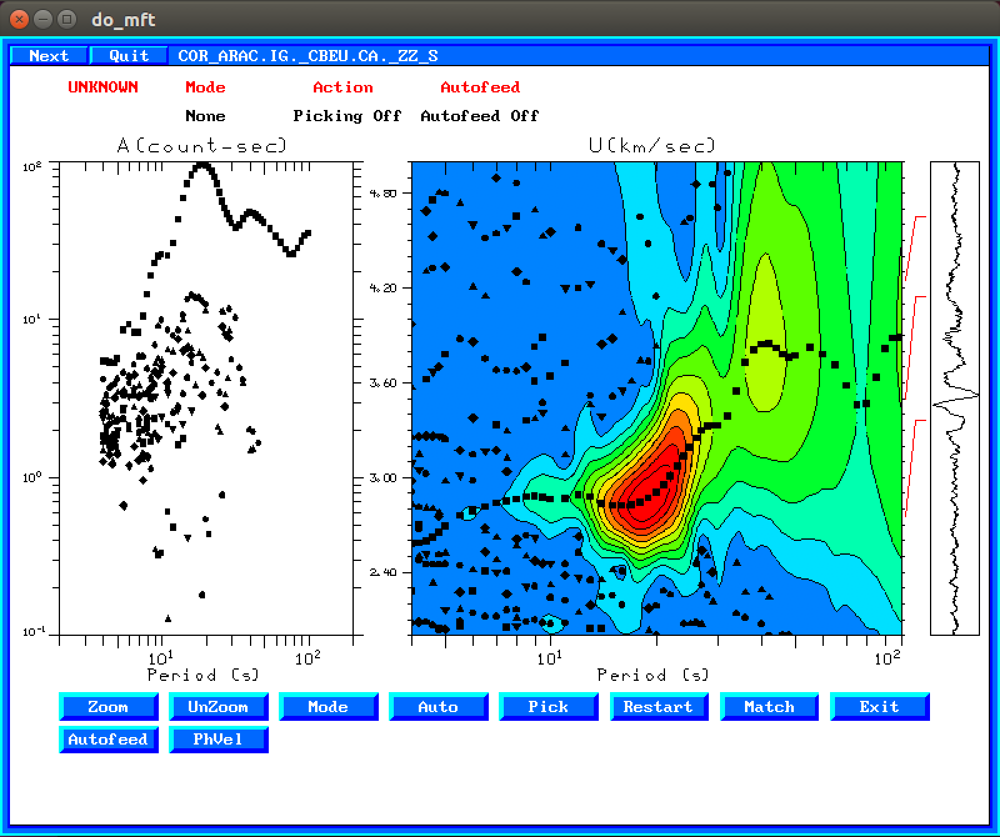
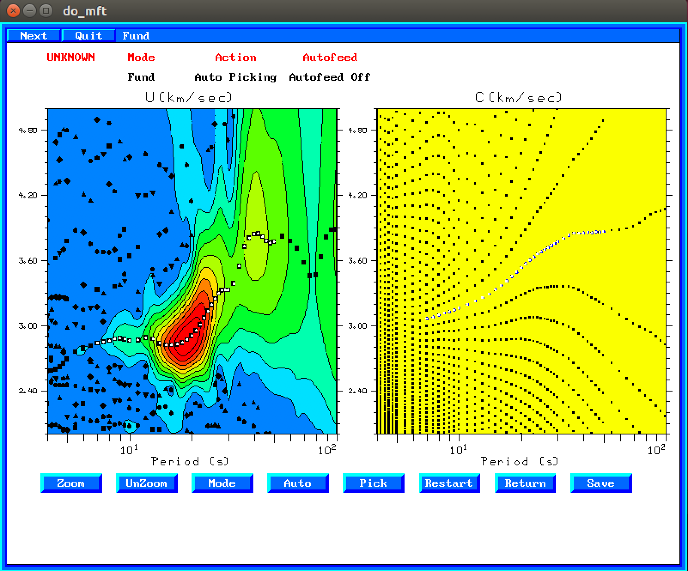
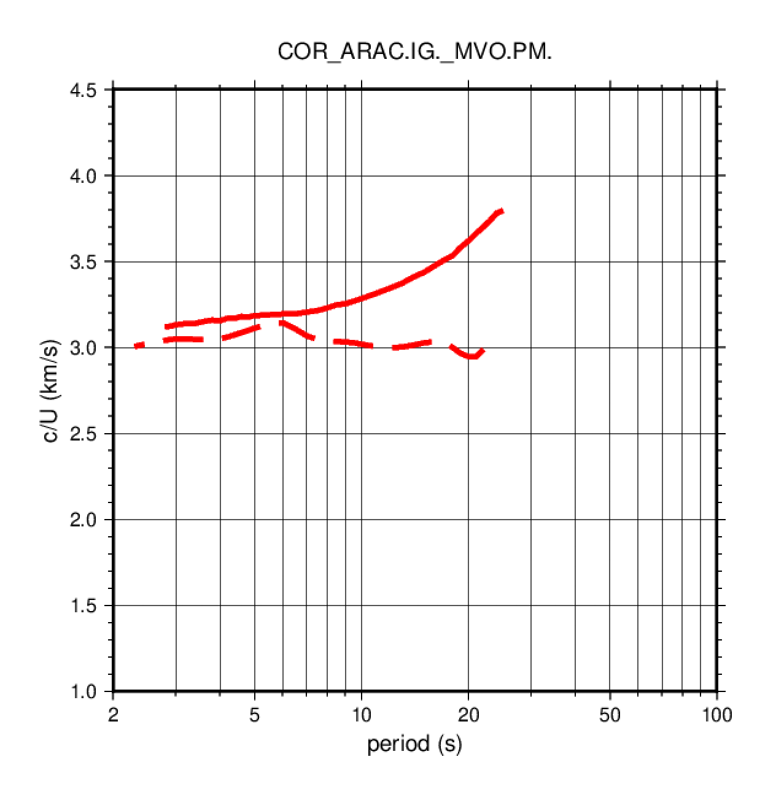
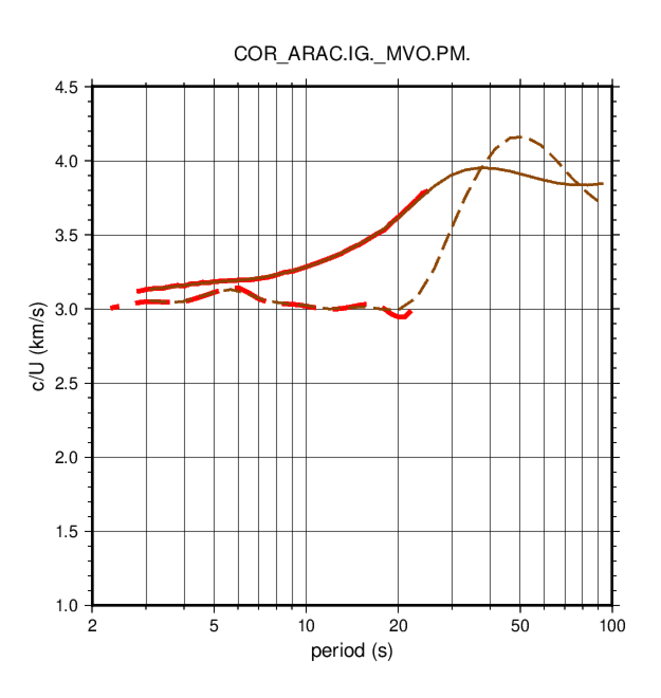

# 3. Procesado de correlaciones de ruido ambiente

En este ejercicio realizaremos medidas de velocidad de fase y de grupo
utilizando un método manual (`do_mft`) y un método automático.


## 3.1. Procesado manual con `do_mft`

La medida de curvas de dispersión para correlaciones de ruido ambiente con
`do_mft` es igual a la medida para registros de terremotos, excepto que,
al conocer la fuente de la correlación (fuerza impulsiva vertical) podemos
medir también la velocidad de fase (y no solo la de grupo como en el caso
de los terremotos).

Ir al directorio que contiene los archivos con las correlaciones de ruido ambiente:

    $ cd 
    $ cd exercises/correlations
    $ ls                                    # ver el contenido del directorio

Para seleccionar las velocidades de fase y de grupo de las correlaciones
de forma manual, ejecutar `do_mft` con las siguientes opciones:

    $ do_mft -G -IG *_S

La pantalla que aparece es igual a la que obteníamos en el caso de terremotos,
excepto que aprarece una opción adicional: `PhVel`



Seleccionar la velocidad de grupo siguiendo los mismos pasos que en el ejercicio 1.
Cuando esté seleccionada hacer click en `PhVel`. Entonces aparecerá la pantalla siguiente:


En el panel de la derecha se muestra de nuevo el análisis FTAN, y en el de la
izquierda las posibles curvas de velocidad de fase. Hay que seleccionar la curva
que tenga unos valores de la velocidad similares (un poco superiores) a la curva
de velocidad de grupo y/o unos valores razonables para periodos largos.
La selección se hace de la misma forma que con la velocidad de
grupo, pulsando primero `Auto` y después haciendo click sobre los puntos que se
quieren seleccionar. Los puntos seleccionados cambian a color blanco, como se 
muestra en la siguiente figura:



También cambian a color blanco los puntos equivalentes el la curva de velocidad
de grupo.

Para salvar la curva de velocidad de fase hacer click en `Save`. Esto generará 
un archivo con el mismo nombre que el archivo del sismograma, añadiéndole la
extensión `.phv`. Después de guardar el archivo de velocidad de fase el programa
vuelve a la pantalla de velocidad de grupo. En esta hay que pulsar `Exit` para
guardar el archivo con la velocidad de grupo (extensión `.dsp`).

Seleccionar por ejemplo el archivo `COR_ARAC.IG._MVO.PM._ZZ_S`, que es el
resultado de correlacionar las componentes verticales (Z) de las estaciones
ARAC (Aracena) y MVO (Marvao, Portugal). Realizar la medida de la velocidad de
fase y de grupo y guardar los resultados (archivos `COR_ARAC.IG._MVO.PM._ZZ_S.phv` y
`COR_ARAC.IG._MVO.PM._ZZ_S.dsp` respectivamente). Estas curvas pueden visualizarse
utilizando el script `plot_aftan_disp.sh`:

    $ plot_aftan_disp.sh COR_ARAC.IG._MVO.PM.   # COR_ARAC.IG._MVO.PM. es el prefijo de los archivos .dsp y .phv

El script producirá un warning de que faltan ciertos archivos (esto es normal puesto que no han sido creados todavía)
y generará un archivo en formato PostScript `COR_ARAC.IG._MVO.PM..ps` que puede visualizarse con el programa `gv`:

    $ gv COR_ARAC.IG._MVO.PM..ps                 # presionar "q" para salir de gv



La curva obtenida debe ser similar a la figura previa. La línea continua roja corresponde a
la velocidad de fase de la onda Rayleigh y la línea discontinua roja la velocidad de grupo.

Debe observarse que la velocidad de grupo es inferior a la velocidad de fase. La velocidad de
fase en general será creciente con el periodo, mientras que la velocidad de grupo puede 
decrecer y presentar máximos y/o mínimos.
verify that phase velocity curves usually do not have minima, while group
velocities often have.

## 3.2. Procesado automático utilizando `FTAN`

Crear un archivo de parámetros llamado `aftan.par`(p.e. utilizando `gedit`) que contenga esta línea:

    -1 1.0 5.0 2 100 20 1 0.5 0.2 2 COR_ARAC.IG._MVO.PM._ZZ_S

El significado de los valores en las diferentes columnas es el siguiente:

1. valor interno (ha de ser siempre -1)
2. velocidad mínima (km/s)
3. velocidad máxima (km/s)
4. periodo mínimo (segundos)
5. periodo máximo (segundos)
6. umbral (threshold). Normalmente 10 ó 20
7. factor para el parámetro de filtrado
8. factor para el taper a la izquierda del sismograma
9. signal-to-noise ratio para el phase-matched filter
10. factor para determinar la ventana del phase-matched filter
11. nombre del archivo con el sismograma/correlación a procesar

Además del archivo de parámetros `aftan.par` también es necesario un archivo que contenga
una curva de velocidad de fase de referencia (promedio). Este archivo se utiliza para hacer
el phase-unwrapping a periodos largos y poder decidir la curva de velocidad de fase correcta.
El archivo ha de tener el nombre `avg_phvel.dat`
y su contenido es simplemente una tabla con dos columnas:
periodo (s) versus velocidad de fase (Rayleigh o Love):

    25   3.67411208
    29   3.731354
    33   3.7900126
    40   3.83514428
    50   3.85978866
    66   3.89791131
    83   3.94684219
    100  4.00932217

El programa que lleva a cabo el análisis `FTAN` de forma automática se llama `aftani_c_pgl` y se ejecuta
de la siguiente forma:

    $ aftani_c_pgl aftan.par

El programa genera muchos archivos de salida por cada sismograma. El ouptut final está en el archivo
con el sufijo `_2_DISP.1`. En particular, el archivo `COR_ARAC.IG._MVO.PM._ZZ_S_2_DISP.1` debería
tener el siguiente ascpecto:

```
   0     2.4990     3.0738       3.0559       3.1335      89.2118   26.546
   1     2.8116     3.1951       3.0545       3.1366      95.1781   18.675
   2     3.1634     3.3792       3.0490       3.1416      98.6959   21.576
   3     3.5591     3.6418       3.0442       3.1492     100.0007   43.248
   4     4.0043     3.9751       3.0510       3.1592      99.5837   48.041
   5     4.5052     4.4000       3.0775       3.1703      97.9055   38.064
   6     5.0687     4.9757       3.1094       3.1813      95.7282   26.265
   7     5.7028     5.6677       3.1311       3.1901      94.0639   34.596
   8     6.4162     6.4176       3.1042       3.1983      92.8465  112.891
   9     7.2188     7.4175       3.0536       3.2166      92.2072   16.057
  10     8.1218     8.7391       3.0346       3.2492      93.0338   13.191
  11     9.1377     9.9074       3.0261       3.2804      95.5471   98.594
  12    10.2808    10.8113       3.0117       3.3062      97.7322  102.493
  13    11.5668    11.8363       3.0007       3.3376      98.5755   91.330
  14    13.0137    13.1025       3.0022       3.3784      98.3737  184.567
  15    14.6417    14.5310       3.0122       3.4247      97.4745  177.030
  16    16.4732    16.0903       3.0118       3.4755      95.8104   78.610
  17    18.5339    17.9128       2.9961       3.5380      93.3626   70.694
  18    20.8523    20.1754       2.9984       3.6215      90.5481  168.184
  19    23.4607    22.9816       3.0772       3.7260      88.0634  158.935
  20    26.3955    26.2221       3.2712       3.8283      86.3873   60.217
  21    29.6973    29.5927       3.5260       3.8993      85.2403  153.496
  22    33.4122    33.1429       3.7558       3.9379      84.0305  151.759
  23    37.5918    37.0773       3.9421       3.9523      82.5334  148.996
  24    42.2942    41.5040       4.0807       3.9475      80.7447  148.715
  25    47.5848    46.5026       4.1547       3.9284      78.7052  149.816
  26    53.5373    52.1546       4.1597       3.9017      76.4666  141.282
  27    60.2344    58.5435       4.1048       3.8736      74.0783  135.621
  28    67.7692    65.7614       4.0021       3.8502      71.5822  128.444
  29    76.2465    73.9076       3.8824       3.8368      69.0113  120.928
  30    85.7843    83.0915       3.7825       3.8357      66.3888  116.806
  31    96.5152    93.4423       3.6997       3.8459      63.7319  113.398
```

El significado de las columnas relevantes es:

1. número de medida
2. periodo nominal de la medida (segundos)
3. periodo instantáneo de la medida (segundos); este es el valor que nos interesa
4. velocidad de grupo (km/s)
5. velocidad de fase (km/s)

El archivo resultante `COR_ARAC.IG._MVO.PM._ZZ_S_2_DISP.1` puede dibujarse también
con el mismo script que utilizamos para las medidas manuales con `do_mft`:

    $ plot_aftan_disp.sh COR_ARAC.IG._MVO.PM.
    $ gv COR_ARAC.IG._MVO.PM..ps

Si para el mismo par de estaciones existen medidas hechas con `do_mft` y con 
`aftani_c_pgl` se superpondrán en el mismo dibujo:



En la gráfica superior las curvas en marrón corresponden a las medidas obtenidas
con el método automático `aftani_c_pgl`, y las rojas con el método manual `do_mft`.
En ambos casos las líneas continuas corresponden a velocidad de fase, y las
discontinuas a velocidad de grupo.

Ejercicio: Cómo haríais para procesar todos los archivos de correlación
en el directorio de trabajo (455 archivos).

