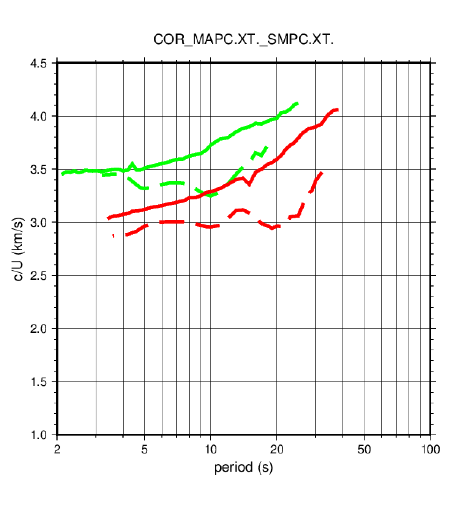
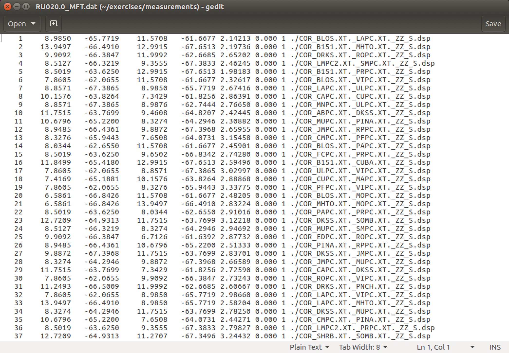
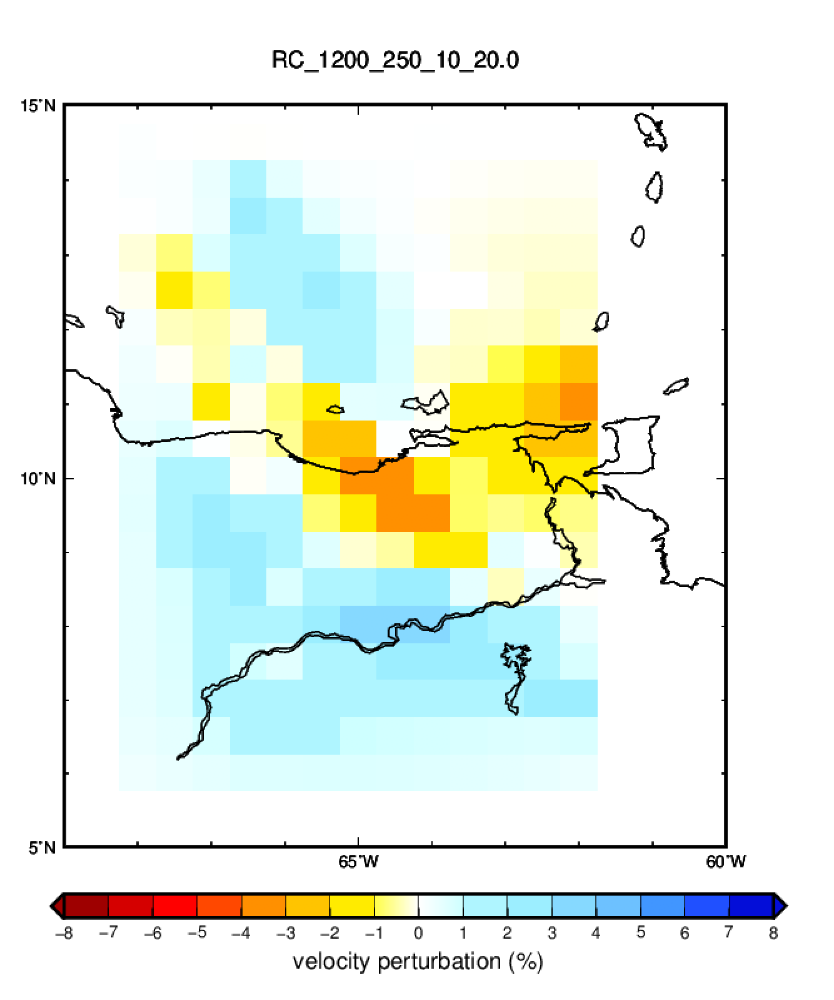

# 4. Tomografía 2D de ondas superficiales

Para este ejercicio utilizaremos unas medidas de dispersión (velocidad de grupo y
de fase de ondas Love y Rayleigh) obtenidas a partir de correlaciones de
ruido ambiente entre estaciones localizadas en el oriente de Venezuela.

## 4.1. Visualizar las medidas de dispersión

Ir al directorio donde se encuentran los archivos con las medidas de dispersión.
Son medidas hechas manualmente con `do_mft` por tanto son archivos con extensión
`.dsp` para las medidad de velocidad de grupo, y `.phv` para las medidas de velocidad
de fase:

    $ cd
    $ cd exercises/measurements
    $ ls

Podréis observar que hay correlaciones `ZZ` que contienen medidas de dispersión de ondas
Rayleigh y correlaciones `TT` que contienen medidas de dispersion de ondas Love.

En primer lugar podemos dibujar las medidas de dispersión obtenidas a partir
de las correlaciones entre dos pares de estaciones. Por ejemplo, para 
dibujar las medidas de dispersión de las correlaciones entre las estaciones MACP y SMPC introducir:

    $ plot_aftan_disp.sh COR_MAPC.XT._SMPC.XT.

Esto genera un archivo PostScript que se puede visualizar haciendo:

    $ gv COR_MAPC.XT._SMPC.XT..ps

Se debería obtener una figura como esta:

Las líneas verde corresponden a las ondas Love y las rojas a las ondas Rayleigh. Las
líneas continuas son velocidades de fase y las discontinuas velocidades de grupo.

Dibujar las medidas de dispersión para varios pares de estaciones y analizar si
muestran el comportamiento esperado (velocidades de fase siempre crecientes y
mayores que las velocidades de grupo, etc.)

## 4.2. Preparar los datos para la tomografía

De los archivos conteniendo medidas de dispersión para trayectorias entre estaciones,
hemos de pasar a archivos que contengan velocidades de grupo y de fase para un solo periodo.
Concretamente para cada periodo deberemos obtener 4 archivos: RC, RU, LC, LU.

Esta reorganización de los datos la lleva a cabo el script `get_mftdisp.sh` que se encuentra
el directorio `/home/seismo/scripts`. Ir a esa directorio, editar el archivo con `gedit` e intentar
entender la secuencia de comandos.

Para ejecutar el script, volver al directorio donde se encuentran las medidas de dispersión:

    $ cd
    $ cd exercises/measurements
    $ get_mftdisp.sh

Este script genera varios archivos con la extensión `.dat`, uno para cada tipo de medida (grupo o fase),
tipo de onda (Love o Rayleigh) y para cada periodo. El contenido del archivo `RU020.0_MFT.dat` debe ser
similar a:

El significado de las columnas más relevantes es:

1. número de la medida
2. latitud de la primera estación (fuente)
3. longitud de la primera estación (fuente)
4. latitud de la segunda estación (receptor)
5. longitud de la segunda estación (receptor)
6. velocidad (km/s). Para el archivo `RU020.0_MFT.dat` corresponderá
   a la velocidad de grupo de la onda Rayleigh a 20 segundos
9. archivo del que procede esta medida

Es posible saber el número de medidas en cada archivo contando el número de líneas:

    $ wc -l *.dat

## 4.2. Surface wave tomography (2D)

Una vez generados los archivos `.dat` para cada periodo y tipo de velocidad y de onda,
ya estamos en condiciones de hacer la tomografía 2D.

Para ello ir al directorio de trabajo:

    $ cd
    $ cd exercises/tomography/RC020.0

En este directorio se encuentran varios archivos:

- `RC020.0.dat`: archivo con las medidas de dispersión (Rayleigh, fase, 20 segundos)
- `contour.ctr`: archivo que define la zona geográfica a invertir
- `tomo.sh`: script de `bash` para correr el programa de tomografía
- `plot_map.sh`: script de `bash` para dibujar los resultados
- `8%_panoply.cpt`: paleta de colores para dibujar los resultados

Editar el archivo `tomo.sh` para ver los pasos requeridos para llevar a cabo la
inversión tomográfica. Para ejecutarlo escribir simplemente:

    $ tomo.sh

Al terminar la ejecución el script escribe en pantalla un número que es el
promedio de todas las medidas de velocidad en el archivo `.dat`. En este caso
debería ser 3.36.

Si el programa corre correctamente, deberá generar varios archivos con el prefijo
`RC_1200_250_10_20.0`. El singificado de los números es:

- alfa: 1200 (sin dimensiones)
- sigma: 250 km
- beta: 10 (sin dimensiones)
- periodo: 20 segundos

El archivo con la extensión `.1` contiene el mapa resultante
de la tomografía.

Para dibujar el resultado (mapa de velocidad de fase de ondas Rayleigh a 20 segundos)
correr el script de dibujo y visualizar el archivo PostScript resultante con `gv`:

    $ plot_map.sh RC_1200_250_10_20.0.1
    $ gv RC_1200_250_10_20.0.ps

Editar el archivo y cambiar los valores de los parámetros alfa y beta y dibujar los resultados.

