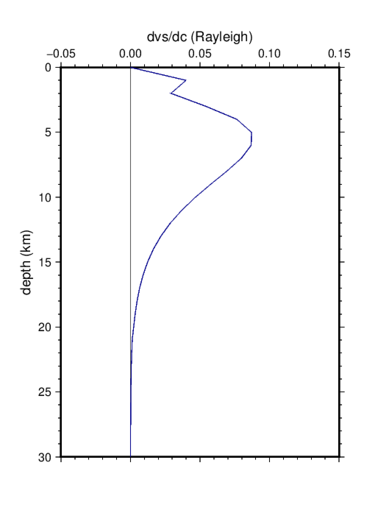

# 5. Kernels de sensitividad

En este ejercicio calcularemos kernels de sensitividad de las
ondas superficiales (LC, LU, RC, RU) para distintos modelos y
periodos.

En primer lugar ir al directorio de trabajo:

    $ cd
    $ cd exercises/kernels

En este directorio se encuentran dos archivos: `mod2kernels.sh` es el
script de `bash` que genera y dibuja los kernels de sensitividad,
y `ak135.mod` contiene el modelo de tierra a utilizar.

Para generar los kernels simplemente introducir:

    $ mod2kernels.sh ak135.mod

Este programa genera 4 archivos PostScript, con la sensibilidad para
cada tipo de medida (velocidad de fase o grupo) y de onda (Love o
Rayleigh): `LC.ps`, `LU.ps`, `RC.ps`, `RU.ps`.

Utilizar `gv` para visualizar los resultados. Por ejemplo:

    $ gv RC.ps

Esto debería generar una figura similar a esta:

Los kernels de sensibilidad han sido calculados para un periodo de 5 segundos.
Si se desea obtener los kernels para otros periodos, cambiar el valor del periodo
en la línea 64 del script `mod2kernels.sh`:

    for period in 5.0; do        # cambiar el valor de 5.0 por valor del periodo deseado

Asimismo puede cambiarse el modelo de tierra utilizado. Por ejemplo, para ver el
efecto de los sedimentos en los kernels, crear un modelo con sedimentos y volver a
correr el script:

    $ cp ak135.mod sediments.mod
    $ gedit sediments.mod                # editar el archivo sediments.mod para añadir una capa de sedimentos
    $ mod2kernels.sh sediments.mod
    $ gv RC.ps
