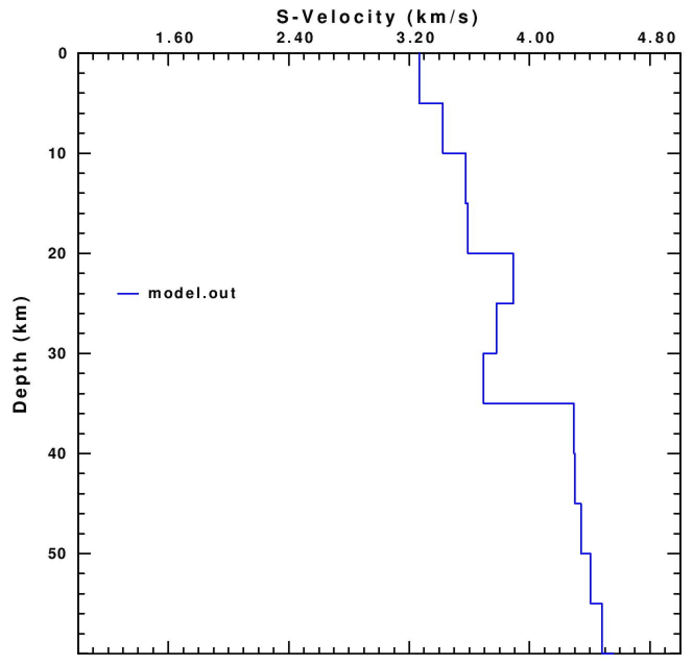
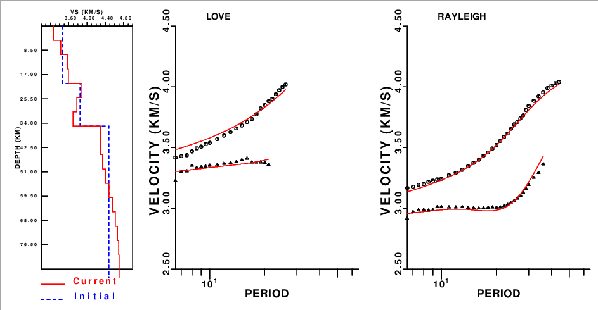

# 6. Inversión 1D

En este ejercicio invertiremos curvas de dispersión para
obtener un modelo de velocidad 1-D de la onda S.

En primer lugar ir al directorio de trabajo:

    $ cd
    $ cd exercises/inversion

Archivos:

- `surf_inv.sh`: script para realizar la inversión
- `ak135.mod`: archivo con la descripción del modelo ak135, utilizado como modelo inicial
- `test.disp`: archivo de prueba con curvas de dispersión para invertir
- `P_*_*.disp`: archivos con curvas de dispersión para varios puntos latitud, longitud

Editar el archivo `test.disp` para ver qué curvas (RC, LC, ...) están incluidas en el archivo:

    $ gedit test.disp

Para invertir las curvas de dispersión en `test.disp` utilizando `ak135.mod` como modelo inicial:

    $ surf_inv.sh test.disp ak135.mod

El programa genera varios archivos de salida:

- `model.out`: modelo resultante de la inversión
- `MODEL.eps`: archivo PostScript con el dibujo del modelo final
- `DATAFIT.eps`: archivo PostScript con plots del modelo final y del
   ajuste de los datos (curvas de dispersión)

Para visualizar los resultados:

    $ gv MODEL.eps

    $ gv DATAFIT.eps

Utilizar otros archivos de dispersión (`P_*_*.disp`) como entrada para la inversión
y otros modelos iniciales.

